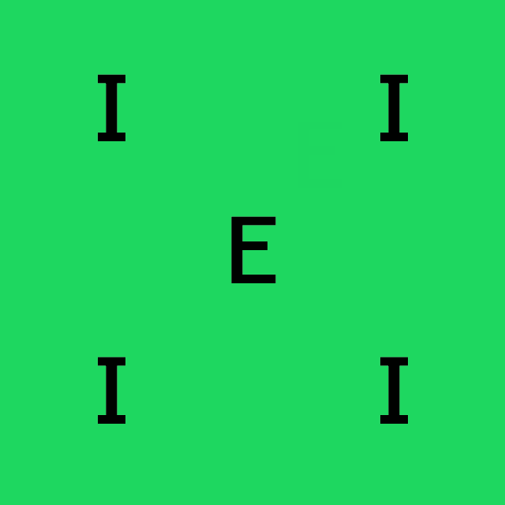
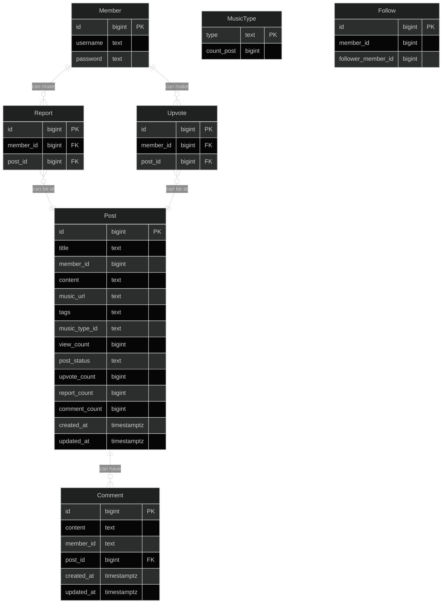
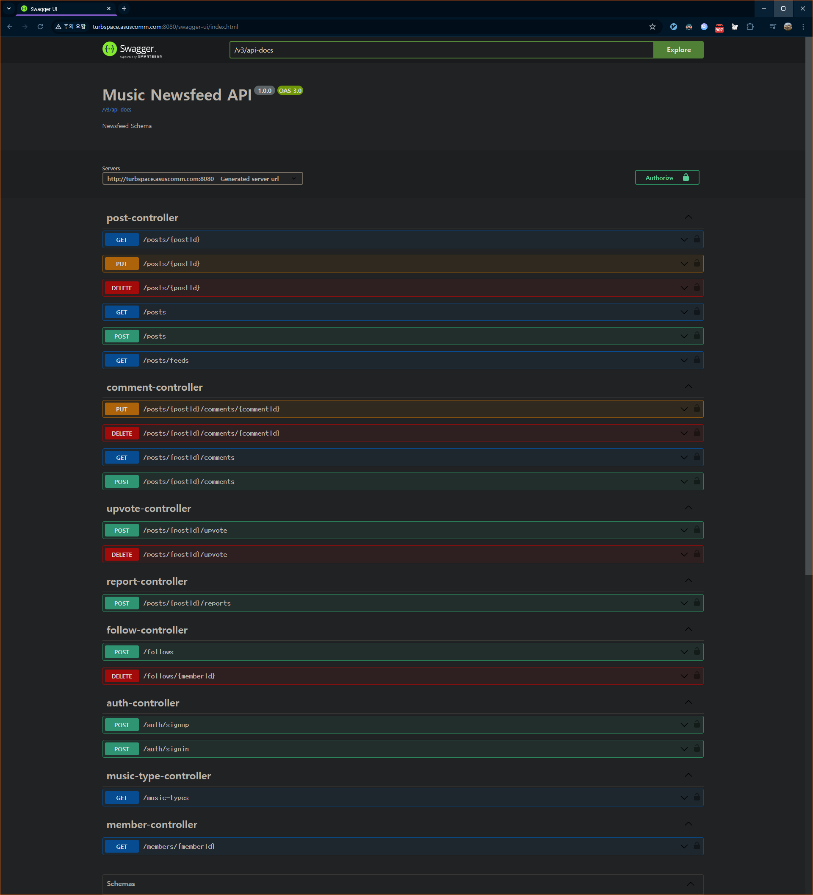

    
    
    

# `MusicNewsFeed`

# 개발 환경

| 기준  | 내용                                                                                                  |
|-----|-----------------------------------------------------------------------------------------------------|
| IDE | `IntelliJ IDEA 2024.1`                                                                              |
| SDK | 개발 언어: `Kotlin 1.9.23`(JVM: `OpenJDK 17.0.3`) 프레임워크: `Spring Boot 3.3.0` 빌드 툴: `Gradle 8.7` |

# Entity-Relationship Diagram (ERD)

# [API Call](https://cold-cover-56c.notion.site/77df80041ace4ce4aea678c03e318c7f?v=4aa3945b53384c19adcd91f6918eeeeb)
